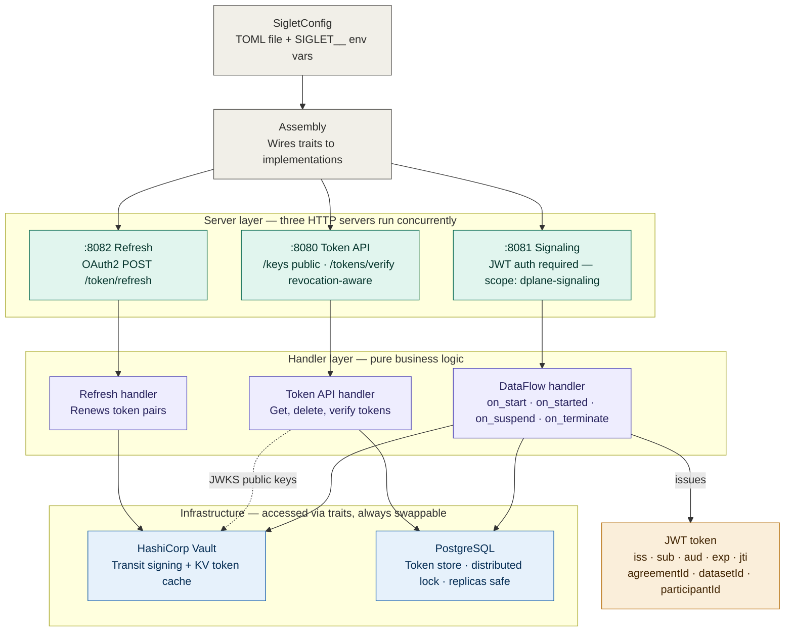
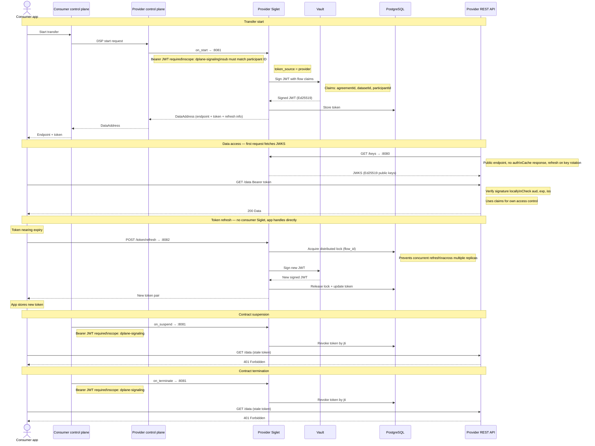

# Siglet — Technical Overview

## What is Siglet?

Siglet is a **Security Token Service (STS)** purpose-built for Eclipse Dataspace ecosystems.
Its job is to control who can access a data endpoint during a live data transfer, without
exposing the underlying data directly. It sits between the control plane (which negotiates
contracts) and the actual data endpoints (which serve the data).

Siglet is a compiled Rust binary that starts three HTTP servers simultaneously:

| Port | Name | Purpose |
|------|------|---------|
| 8081 | Signaling API | Receives DPS lifecycle events from the control plane |
| 8080 | Token API | Issues, verifies, and revokes tokens + public JWKS endpoint |
| 8082 | Refresh API | OAuth2-compatible token renewal |

---

## Provider vs Consumer Role

A single Siglet instance can serve two roles, determined by `token_source` in its config:

**Provider-side Siglet** — issues short-lived signed JWTs to consumers so they can access
a data endpoint. When the control plane fires `on_start`, the provider Siglet calls
HashiCorp Vault to sign a JWT containing the contract claims (`agreementId`, `datasetId`,
`participantId`), stores the token in PostgreSQL, and returns a `DataAddress` to the
control plane containing the endpoint URL, the token, and refresh info.

**Consumer-side Siglet** — acts as a local token cache. When `on_started` fires, it stores
the received token. It handles automatic renewal before expiry using a distributed
PostgreSQL lock to prevent multiple replicas from refreshing the same token simultaneously.

> In the current deployment there is only a **provider-side Siglet**. The consumer app
> receives the token directly from the control plane and is responsible for refresh itself.

---

## Diagram 1 — Internal Architecture

The following diagram shows what runs inside a Siglet instance, from startup to
infrastructure. Arrows show which component calls which.

[Link to the diagram above on mermaid](https://mermaid.live/edit#pako:eNptVN1u6kYQfpWRI_WmToKNDY4vKjmAk5yTo1BwE6mlihazwDZm191dw6FJpD5E36X3fZQ-SWf9QwynRsLenf2-mfl2Zl6tVCyoFVrLTOzSNZEakuGMAz6D-OaXmTVlq4zqgeBLtprNePLw5R6WLKPwPUzvbu5HyfMzUL6FLZFqZv1aQaPpF4RGStHNPNsj7IlJqkBLwjS-BLBNntEN5ZpoJvgHEH3C-fkPhuDAVG5MAwe-w_9O-e_OeGVWxXwlSb6GKZVbKpUJuPyCjOzx_98__wK9lpTCbZKMQVWnQBYcUsHTQkqMASNs_JsHXSFNGHTQJWbPSca4Sf3TUwKk0GuQ9PcC81mU7CoVOQ1hkWeE03N1OH_M2KkZO5CIF8ohGt8h4-UL3SvIi3nGUvjnb7jUxqguMUa23KOfrUhLgc7Jjkh6wunWnC5M6BLlXSPjQ4QBujB-mCY126WsjQ2Y8kWjnhHViHs7jJuNTrWRRM2GW21M4m8kvyV8kVWa158t0fNCUpgXinGqFGRixdKj8NEl4oZEkxgLD9YVAWYg-LPSpgxRj-Ybpa5Xhcox_nqlqdwwTvSxMBg7Mh9kblHfUG3DgmI5UxtqjSvFjwkmJrRa0xZ8QjndqQoBOWGtem9piokZxd6YUgVVb4BVg2ymdkog8qDFJIA6mhcpynTo19y8ftMMT5AVVqzpjrvStkCVFK0XOerBUpYTYz0EUHuFx-in-wRbZHxT7ydRuX-0vsDwPj19njaVZ6rwrYLWpyYttm_u_Y4vJcGcyrfSski1uWxz6yRN8brxuraM1N1uA8l2BMtc7Uiek3l2fFuli7KC1JoNhMzhkRSZNpNGEq6YBtNS2FA4bz4_1uKnJF0f04zNqBoLpVG56Y_3Bl6eVFpgaEZDhpGyeWFqKRPpi9mTNMf0CYZGlvT_7jLNiFJDuoSyCovcDL4sPIudUTwKbCREH-GZH_sjP7JTkQkZnrkD_EWn-GomVfCRg4DRAd6JeyO_18A7XtdzByfwugYb_Gg0jD_wfteLrvsH9z3X8U_xzNxUg-7FTnx9QDuBH0f-h3d34HdP0JXmdeoROo8O6Ouo7zsH357jeh23hTbj3DYTvNavbcLZY-O4sc2EqeRpW7GebaxV21Ri04Etc1k19vimyqxtOTSaZVsryRZWiAVKbWuDs4KYpfVqjs8svcYOwwGKnwsiX2bWjL8jBvvqZyE2DUyKYrW2wiXJFK6KHFuRDhn2J_k4ggVD5UAUXFuh65QUVvhqfcWV373wguDKdbqB03UCp2dbe9y-urjq9r3A8_t9v-f1vO67bf1Reu1cBH3vqv28_wdChnUA)

**Key points:**

- `SigletConfig` loads from a TOML file, with `SIGLET__` environment variables overriding
  individual fields at runtime.
- `Assembly` is the composition root — it wires all traits to their concrete implementations
  (e.g. `TokenManager` → `JwtTokenManager`, `LockManager` → `PostgresLockManager`).
- The three servers start concurrently and share a `CancellationToken` — if one crashes,
  all three shut down together.
- Vault is never called directly from handlers. It is always accessed via a trait, making
  the signing backend swappable without touching business logic.
- The `/keys` JWKS endpoint is **public** (no auth required). All other token API routes
  require a JWT with `scope: siglet-token-api`.
- PostgreSQL is safe for multi-replica deployments — the distributed lock ensures only one
  replica refreshes a given token at a time.

---

## Diagram 2 — End-to-End Transfer Flow

The following sequence diagram shows the full lifecycle of a data transfer: from the
consumer app initiating a transfer, through token issuance, data access, refresh, and
contract termination.

[Link to the diagram above on mermaid](https://mermaid.live/edit#pako:eNrVVttu4zYQ_ZWBnmKskviaOAK6QOqkQdpiq67TLVAYWNDiyGYtkSpJJesGAfrUDyj6hfslHVKX2Gttun2sX0xzhjOHZ-YM_RgkimMQBQZ_K1EmeCXYSrN8IYE-LLFKw2VRADMwU9KUOWpgRVGZC6atSETBpIXZLN5zSpS0WmVQZEzioXtcucda3Qv-Be5zsdrzp98Z2kPHd6zMrPP0i45ANz6MMnalcf7j94cel_HtXqa31_M7t7mQle8bZRHUPXpeQjJEcKeZNCntGEuBGkcyH79-TbxEMHf7YGu3ykwGMsfOfDWPq6OgXRVMjTuuPOiqESj5vvL4-OdfEE3708EOGi1WawsqBR_ta2SasHz7850PJzTyxUKaRBUYAfcEHxuxkiwTcuUs5RLy0ljImU3We1zcXnVm8Yis2iCBUqVOEL6Couarhk4uhN0XIXLFkh7Pg7BrSDP1AEnGRG66otdnZt4hAupGxBylveUhcGaZQb_cgXnLqzj-5HFLmcuK3Oc9uubDyWRw0dtDF9-4yiiN1V12bG1hKN8l5xqNgSOUvFCCWHlV-dO3xpRsaxAyVb3nojVl3zn-XHMyUmdEcP1JuBf6y8UhLSYOxsc__oZUaNP2CqRIZUNDF_1u3vZefNvycHN9B6cb3Jq2d_pdvPtMcbnMRALNVUOQClhp19QmM0ZZKKkpSOIYtndXEig4aGWZFeoTFn1QB6wtARRVCgeotysU7-qxuio3XbxTmQ6471CLdAu-m21JhcxUwrJs6-CuMdkQdmoV_FCEIIz5bJifDNFXdSSkNPDUg2zorufSM6tN-Yb9vq_LS2PBd0nDkyscsZk0A7KaYKGbprBmkmeEgZNYE0v4u4I2ASUxQ8p11xJ6u0thVe_4BxpYp5640zZ5XfnhgQAuEz8iKLWxWixLS5IhFjdw5HT6XvBe5wigk7HGe9Kl5ygptaZ1c1ninyVaEX85SVIUmWucgsrOzGfng8QHp9VOKb8hm2nlfHCHt5ghzYUK9ysoC-qgTlF7Fl2wSsAFE7qTaPfiGTcZjIf1b_qcuSahtxJMaQqUxstgb8q3M9w78Jen-Oy_T_FDRu4Jc33N5RZ-teIFrR3R05LV3r3DVh_3B_CN0kvB-ZfRYFHnQtbjoJOHxgP_x0wEYbDSggeR1SWGAWk6Z-5n8OgOLgK7pndrEUS05ExvFsFCPtEZerF-USpvjmlVrtZBlLKMhmpQtW79H6zdJWnRyzpTpbRBNPEhgugx-BBEw8noZDydXgwHo-lgNJgOzsJgS9sXJxej8_F0PDk_n5yNz8ajpzD43Wftn0zPJ0__AIulRaM)

**Key points:**

- Every call into `:8081` requires a Bearer JWT with `scope: dplane-signaling`. The `sub`
  claim must match the `participant_context_id` in the URL path, preventing one participant
  from impersonating another.
- The Provider REST API verifies tokens **locally** using the JWKS from `:8080/keys`. This
  avoids a network call on every request. The JWKS response should be cached and refreshed
  only when signature verification fails (indicating a key rotation).
- Vault never exposes the private key. It receives the JWT payload and returns only the
  signature via the transit secrets engine.
- `on_suspend` and `on_terminate` both revoke the token by `jti` in PostgreSQL. Local JWKS
  verification will not detect this revocation until the token's `exp` is reached — use
  `POST :8080/tokens/verify` when immediate revocation detection is required.
- Since there is no consumer-side Siglet in this deployment, the consumer app is
  responsible for calling `:8082` to refresh its token before expiry.
 
